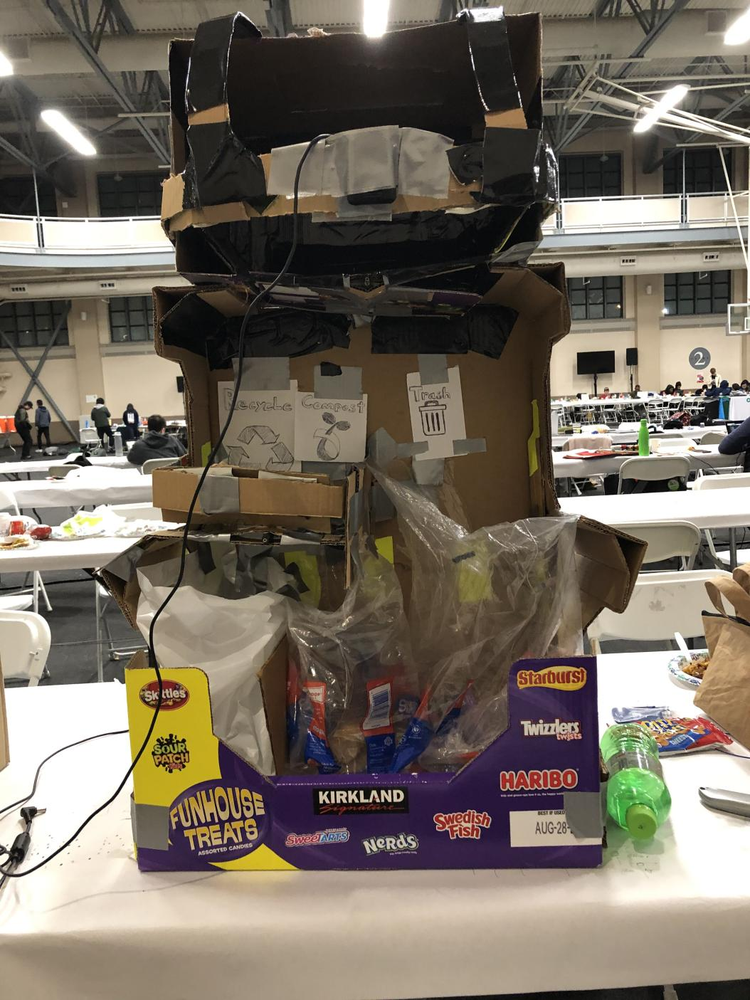
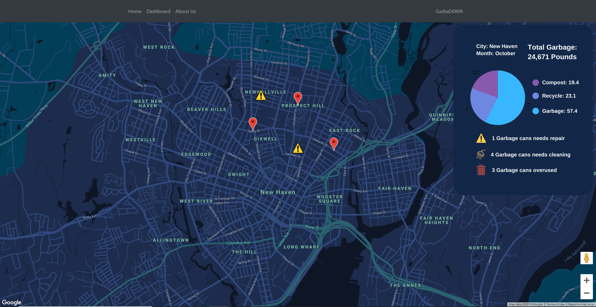
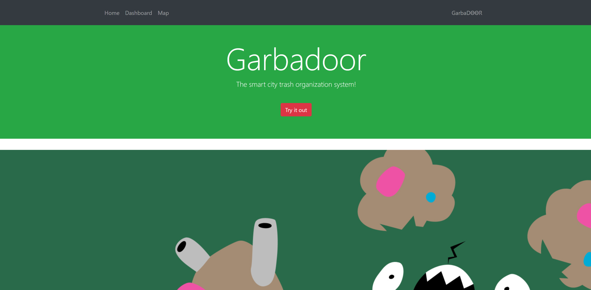

# Garbadoor
Hello! Thanks for checking out the Yhack 2019 self sorting garbage can, Garbadoor!
This hack was nominated for and won the Best Use of Google Cloud award during the event.

Additional Credits for this hack go to @nicoledanuwidjaja, @VKong6019 and @RayRuizheLi.

## Demo
You can check out a full demo of the garbage can here:
[Demo](https://www.youtube.com/watch?v=qmpBA5ZwOQA&feature=emb_logo), \\
and can learn more about the process of making it here: 
[Devpost](https://devpost.com/software/garbadoor) \\

\\ Physical Hack:

\\ Arduino Powered:

\\ Smart City Statistics

\\ Sleek Dashboard Appearence

## How does it work?

In a nutshell, we used Google's Machine Learning Vision API to recognize
the type of garbage, and sorted it with some arduino magic. During this time,
we kept track of some neat statistics with a firebase database for city maitenance.

That was just the quick rundown, but please checkout the devpost for more information!

## The smart city trash organization system!

YHack2019
